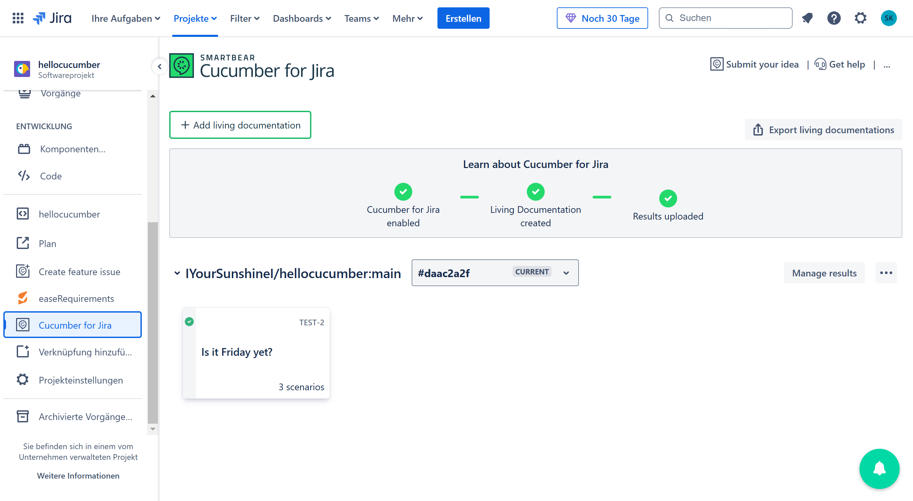
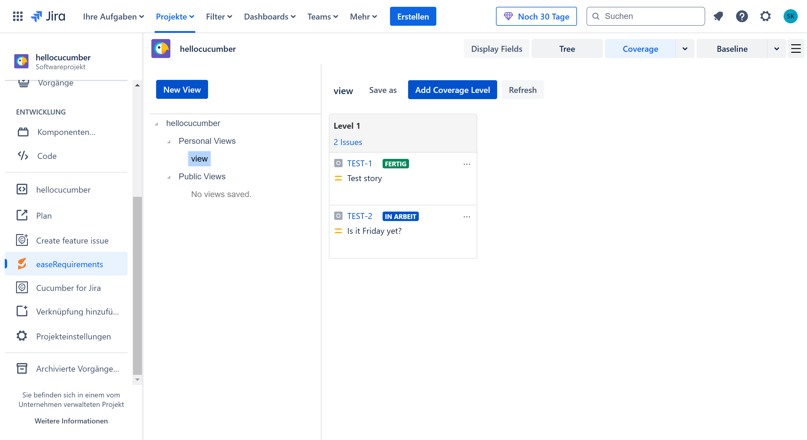

# hellocucumber
This is a test repo for ASE, where we checkout Cucumber's Gherking and explore Jira plug-ins :).

## Cucumber Integration

1) Add the cucumber dependency to the `pom.xml` file:
```xml
<dependency>
    <groupId>io.cucumber</groupId>
    <artifactId>cucumber-java</artifactId>
    <version>7.20.1</version>
    <scope>test</scope>
</dependency>
```

2) Create a new directory `src/test/resources/hellocucumber` and add a new file `is_it_friday_yet.feature`:
```gherkin
Feature: Is it Friday yet?                      # This is the feature definition (not executed)
  Everybody wants to know when it's Friday      # This is the feature description (not executed)

  Scenario: Sunday isn't Friday                 # This is the scenario definition (i.e. a test case)
    Given today is Sunday                      
    When I ask whether it's Friday yet         
    Then I should be told "Nope"               

  Scenario: Friday is Friday
    Given today is Friday
    When I ask whether it's Friday yet
    Then I should be told "Yessir"

  Scenario Outline: Today is or is not Friday   # Alternative way to define scenarios
    Given today is "<day>"                      # Here day is a variable
    When I ask whether it's Friday yet
    Then I should be told "<answer>"            # Same here

    Examples:                                   # This is a table of examples
      | day            | answer |               # Which are used to fill in the variables
      | Sunday         | Nope   |
      | Friday         | Yessir |
      | anything else! | Nope   |
```

3) Create a new directory `src/test/java/hellocucumber` and add a new file `RunCucumberTest.java`:
```java
package hellocucumber;

import org.junit.platform.suite.api.ConfigurationParameter;
import org.junit.platform.suite.api.IncludeEngines;
import org.junit.platform.suite.api.SelectPackages;
import org.junit.platform.suite.api.Suite;

import static io.cucumber.junit.platform.engine.Constants.PLUGIN_PROPERTY_NAME;

@Suite
@IncludeEngines("cucumber")
@SelectPackages("hellocucumber")
@ConfigurationParameter(key = PLUGIN_PROPERTY_NAME, value = "pretty")
public class RunCucumberTest {
}
```

4) Create a new directory `src/test/java/hellocucumber` and add a new file `StepDefinitions.java`:
```java
package hellocucumber;

import io.cucumber.java.en.*;

import static org.junit.jupiter.api.Assertions.*;

class IsItFriday {
    static String isItFriday(String today) {
        if (today.equals("Friday"))
            return "Yessir";
        return "Nope";
    }
}

public class StepDefinitions {
    private String today;
    private String actualAnswer;

    @Given("today is Sunday")
    public void today_is_sunday() {
        today = "Sunday";
    }

    @Given("today is Friday")
    public void todayIsFriday() {
        today = "Friday";
    }

    @Given("today is {string}")
    public void today_is(String today) {
        this.today = today;
    }

    @When("I ask whether it's Friday yet")
    public void i_ask_whether_it_s_friday_yet() {
        actualAnswer = IsItFriday.isItFriday(today);
    }

    @Then("I should be told {string}")
    public void i_should_be_told(String expectedAnswer) {
        assertEquals(expectedAnswer, actualAnswer);
    }

}
```

These methods are not automatically created, but when running ```mvn test``` with only the ```is_it_fryday_yet.feature``` file,
the methods with an empty body are shown in the console. You can copy them and paste them in the ```StepDefinitions.java``` file 
and fill them with code that turns the phrase into concrete actions.

5) Run the tests with ```mvn test```.

### Refactoring!
The class `IsItFriday` should not be in the `StepDefinitions` class. It should be contained, where the production
code is located.

## Jira Plugin for Requirement Management
I have set up a Jira project and added the two plugins `easeRequirements` and `Cucumber for Jira`.
After connecting the Jira project with this repository, the cucumber plugin automatically recognized the
`is_it_friday_yet.feature` file and created a new requirement in Jira.

After changing the Cucumber runner to the following code:
```java
package hellocucumber;

import io.cucumber.junit.platform.engine.Cucumber;
import org.junit.platform.suite.api.ConfigurationParameter;
import org.junit.platform.suite.api.IncludeEngines;
import org.junit.platform.suite.api.SelectPackages;
import org.junit.platform.suite.api.Suite;

import static io.cucumber.junit.platform.engine.Constants.PLUGIN_PROPERTY_NAME;

@Suite
@IncludeEngines("cucumber")
@SelectPackages("hellocucumber")
@ConfigurationParameter(key = PLUGIN_PROPERTY_NAME, value = "pretty, json:target/cucumber-report.json")
public class RunCucumberTest {
}
```
and adding the following GitHub Actions workflow:
```yaml
name: Java CI with Maven

on:
  push:
    branches: [ "main" ]
  pull_request:
    branches: [ "main" ]

jobs:
  test:
    runs-on: ubuntu-latest
    steps:
      - uses: actions/checkout@v4
      - name: Set up JDK 17
        uses: actions/setup-java@v4
        with:
          java-version: '17'
          distribution: 'temurin'
          cache: maven

      - name: Test
        run: mvn test

      - name: Upload Cucumber JSON Report to Jira
        if: always()
        run: |
          curl -X POST https://c4j.cucumber.io/ci/rest/api/results \
          -H "authorization: Bearer ${{ secrets.JIRA_TOKEN }}" \
          -H 'content-type: multipart/form-data' \
          -F results_file=@target/cucumber-report.json \
          -F language=jvm
```
the test results are now automatically uploaded to Jira after every push to the main branch.

The following images illustrate the issue we implemented beforehand in Jira:

*Cucumber for Jira Overview.*


*Cucumber for Jira, where the Scenarios have not been tested yet.*


*Cucumber for Jira, where the Scenarios have been tested and the results have been uploaded with the GitHub Action.*


*The issues from the Cucumber Plug-in can be imported to the easeRequirements Plug-in.*


## Conclusion
### Cucumber
Cucumber/Cucumber's Gherkin is actually a cool tool and ez to use. So I would recommend that we use it in our ASE project.

### Jira
#### Cucumber for Jira
This plug-in is really nice and allows for a good overview of the Scenarios within our project. Especially the integration with the GitHub Actions which allow for
automatic upload of the test results is a nice feature.

#### easeRequirements
I really do not get the point of this plug-in. It feels like it provides just another view of issues. The part where you can import issues from the Cucumber plug-in is nice
but why have an extra plug-in for something we can already do with ``Cucumber for Jira``?

All in all ``Cucumber for Jira`` is cool, `easeRequirements` feels unnecessary. However, I think we are not going to use any of them since we do not have a Jira license :)).
